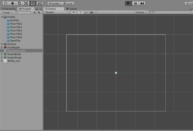
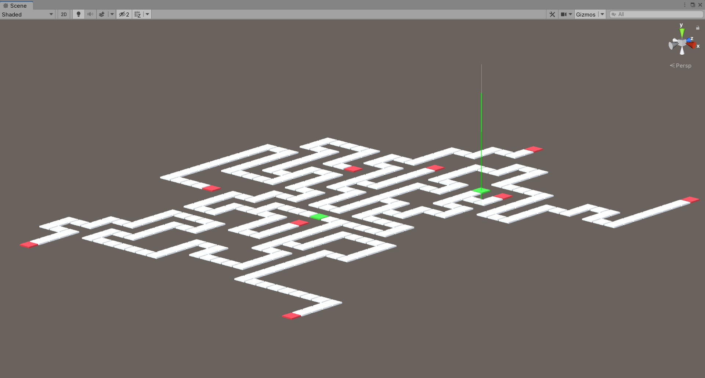
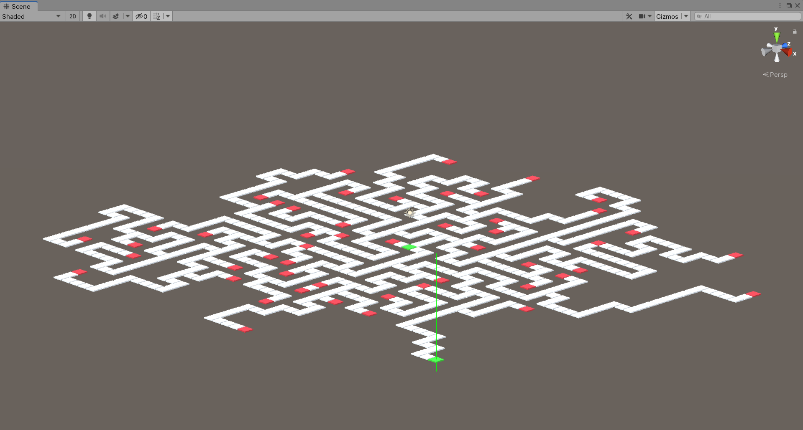

# MazeRunner

After University I used my maze generation skills to develop an infinite runner for mobile. From primarily learning Java at University I wanted to challenge myself by learning C# in Unity.

I developed a procedural generation algorithm that allows me to generate many different levels of varying difficulty, these are not  technically mazes as they need a path in and path out. The gif below shows an early development of how the maze is formed in real time.

The algorithm allows for many different constraints to be applied to the maze changing the outcome dramatically. Below are two varying mazes. 

Easy difficulty 

Harder difficulty

When playing the game in the level select there is a “custom” option that allows the player to edit these values and create their own level. This allows for the user generated content and allows for many different types of levels to be created easily. 

